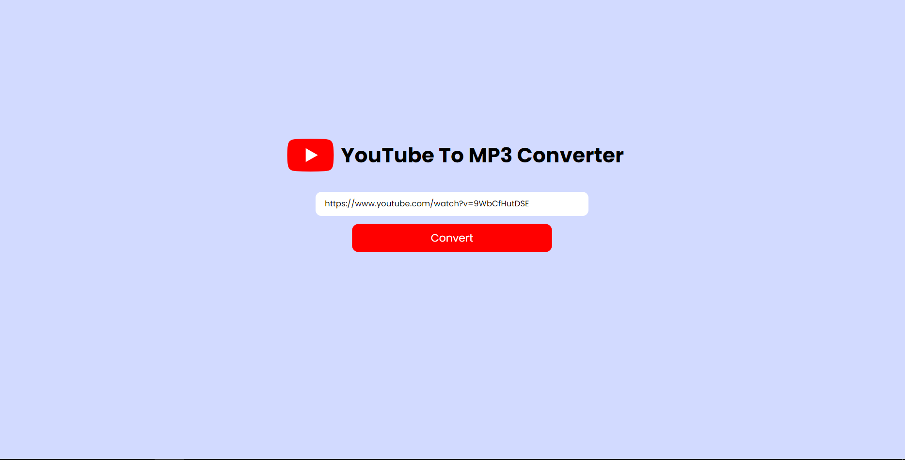
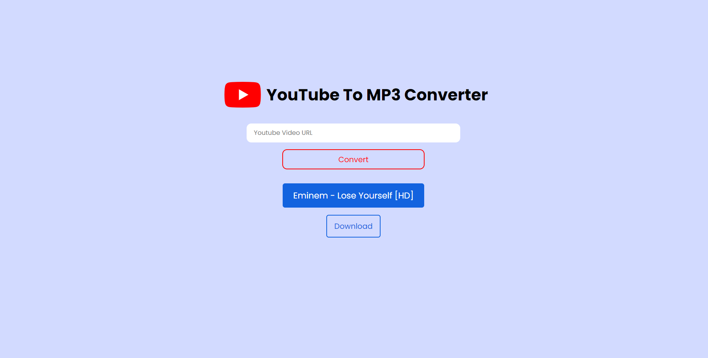

# **Youtube TO MP3 Converter**

> A website where you can convert a youtube video to MP3.

> Youtube videolarını MP3'e dönüştürebileceğiniz bir internet sitesi.

> Here's how it looks in Heroku : [Youtube To MP3 Converter](https://muhi-youtubetomp3converter.herokuapp.com)

## **Technologies(Teknolojiler)**

- **NodeJS**
- **Express**
- **Node-Fetch**
- **Dotenv**

## **Installing / Getting started (Yükleme / Projeyi çalıştırma)**

1. git clone https://github.com/mustafahincal/youtubeToMP3Converter.git
2. npm install
3. Go to https://rapidapi.com/ytjar/api/youtube-mp36 and get your free API key by choosing the freemium subscription plan.   (https://rapidapi.com/ytjar/api/youtube-mp36 adresine gidin ve freemium abonelik planını seçerek ücretsiz API anahtarınızı alın.)
   
4. Add a .env file to the project and add the following variables: API_KEY and API_HOST.
     (Projeye bir .env dosyası ekleyin ve şu değişkenleri ekleyin: API_KEY ve API_HOST)
5. npm run dev

## **Project Images (Proje Görüntüleri)**

